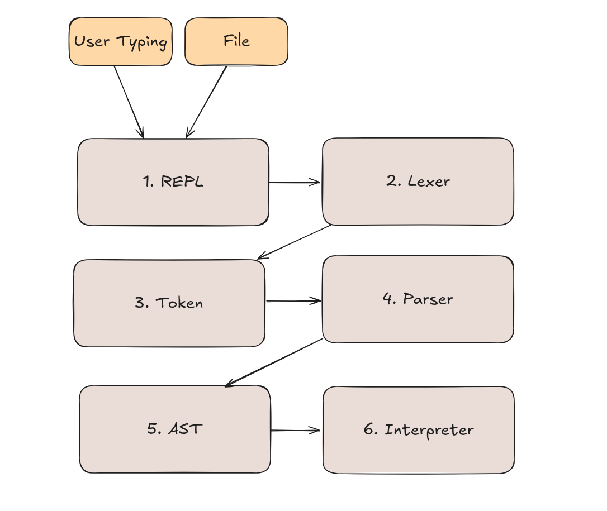

# Tupilang


### Rationale

This is a simple POC on how to create a toy programing language.
Interesting things here:
1. Uses Java 23
2. No libraries, No external dependencies
3. Heavily inspired by Scala 3
4. However, much more simple
5. REPL
6. So far supports:
 * Types: int, string, void
 * Keywords: if, return
 * Create functions with def, comments with //
 * Built-in functions: print

Tupilang binary: jar size it's only *`33KB`* .<br/>
Created by Diego Pacheco in APRIL/2025.

### Build 

```bash
./mvnw clean install package
```

### Run REPL

```
./repl.sh
```

### Result

```
❯ ./repl.sh
 _______             _   _
|__   __|           (_) | |
   | | _   _ _ __    _  | |     __ _ _ __   __ _
   | || | | | '_ \  | | | |    / _` | '_ \ / _` |
   | || |_| | |_) | | | | |___| (_| | | | | (_| |
   |_|\__,_| .__/|  |_| |______\__,_|_| |_|\__, |
           | |                              __/ |
           |_|                             |___/

    Tupi Lang by Diego Pacheco
  🌿 Version 1.0-SNAPSHOT - written in Java 23 🌿

:> val x = 10;
:> if (x == 10) {
  print(x);
}... ...
10
:> val xxx = "test";
:> print(xxx);
test
:> def sum(a:Int, b:Int) int {
  return a + b;
}... ...
:> print(sum(100,200));
300
:>
:> val x = 10;
:> val y = 20;
:> val name = "Diego";
:> def printAll() void {
... print(x);
... print(y);
... print(name);
... }
:> printAll();
10
20
Diego
:>

```

### Running .tupi files

```bash
./repl.sh samples/main.tupi
```

samples/main.tupi
```scala
val x = 10;
if (x == 10) {
  print(x);
}

val xxx = "test";
print(xxx);

def sum(a:Int, b:Int) int {
  return a + b;
}
print(sum(x,x));
```

result
```scala
10
test
20
```

### Tests

```bash
./mvnw clean test
```

```
[INFO]
[INFO] -------------------------------------------------------
[INFO]  T E S T S
[INFO] -------------------------------------------------------
[INFO] Running com.github.diegopacheco.tupilang.lexer.LexerTest
Unterminated string.
[INFO] Tests run: 9, Failures: 0, Errors: 0, Skipped: 0, Time elapsed: 0.059 s -- in com.github.diegopacheco.tupilang.lexer.LexerTest
[INFO] Running com.github.diegopacheco.tupilang.interpreter.InterpreterTest
[INFO] Tests run: 10, Failures: 0, Errors: 0, Skipped: 0, Time elapsed: 0.023 s -- in com.github.diegopacheco.tupilang.interpreter.InterpreterTest
[INFO] Running com.github.diegopacheco.tupilang.parser.ParserTest
[INFO] Tests run: 7, Failures: 0, Errors: 0, Skipped: 0, Time elapsed: 0.015 s -- in com.github.diegopacheco.tupilang.parser.ParserTest
[INFO] Running com.github.diegopacheco.tupilang.token.TokenTest
[INFO] Tests run: 16, Failures: 0, Errors: 0, Skipped: 0, Time elapsed: 0.023 s -- in com.github.diegopacheco.tupilang.token.TokenTest
[INFO] Running com.github.diegopacheco.tupilang.ast.IfStatementTest
[INFO] Tests run: 4, Failures: 0, Errors: 0, Skipped: 0, Time elapsed: 0.009 s -- in com.github.diegopacheco.tupilang.ast.IfStatementTest
[INFO] Running com.github.diegopacheco.tupilang.ast.FunctionDefinitionTest
[INFO] Tests run: 5, Failures: 0, Errors: 0, Skipped: 0, Time elapsed: 0.010 s -- in com.github.diegopacheco.tupilang.ast.FunctionDefinitionTest
[INFO] Running com.github.diegopacheco.tupilang.ast.VariableExprTest
[INFO] Tests run: 5, Failures: 0, Errors: 0, Skipped: 0, Time elapsed: 0.009 s -- in com.github.diegopacheco.tupilang.ast.VariableExprTest
[INFO] Running com.github.diegopacheco.tupilang.ast.LiteralStringExprTest
[INFO] Tests run: 5, Failures: 0, Errors: 0, Skipped: 0, Time elapsed: 0.008 s -- in com.github.diegopacheco.tupilang.ast.LiteralStringExprTest
[INFO] Running com.github.diegopacheco.tupilang.ast.LiteralIntExprTest
[INFO] Tests run: 6, Failures: 0, Errors: 0, Skipped: 0, Time elapsed: 0.009 s -- in com.github.diegopacheco.tupilang.ast.LiteralIntExprTest
[INFO] Running com.github.diegopacheco.tupilang.ast.ValDeclarationTest
[INFO] Tests run: 3, Failures: 0, Errors: 0, Skipped: 0, Time elapsed: 0.003 s -- in com.github.diegopacheco.tupilang.ast.ValDeclarationTest
[INFO] Running com.github.diegopacheco.tupilang.ast.ReturnStatementTest
[INFO] Tests run: 4, Failures: 0, Errors: 0, Skipped: 0, Time elapsed: 0.007 s -- in com.github.diegopacheco.tupilang.ast.ReturnStatementTest
[INFO] Running com.github.diegopacheco.tupilang.ast.BinaryExprTest
[INFO] Tests run: 5, Failures: 0, Errors: 0, Skipped: 0, Time elapsed: 0.017 s -- in com.github.diegopacheco.tupilang.ast.BinaryExprTest
[INFO] Running com.github.diegopacheco.tupilang.ast.CallExprTest
[INFO] Tests run: 5, Failures: 0, Errors: 0, Skipped: 0, Time elapsed: 0.011 s -- in com.github.diegopacheco.tupilang.ast.CallExprTest
[INFO] Running com.github.diegopacheco.tupilang.ast.PrintStatementTest
[INFO] Tests run: 4, Failures: 0, Errors: 0, Skipped: 0, Time elapsed: 0.006 s -- in com.github.diegopacheco.tupilang.ast.PrintStatementTest
[INFO] Running com.github.diegopacheco.tupilang.ast.ExpressionStatementTest
[INFO] Tests run: 4, Failures: 0, Errors: 0, Skipped: 0, Time elapsed: 0.004 s -- in com.github.diegopacheco.tupilang.ast.ExpressionStatementTest
[INFO] Running com.github.diegopacheco.tupilang.repl.REPLTest
[INFO] Tests run: 4, Failures: 0, Errors: 0, Skipped: 0, Time elapsed: 0.036 s -- in com.github.diegopacheco.tupilang.repl.REPLTest
[INFO]
[INFO] Results:
[INFO]
[INFO] Tests run: 96, Failures: 0, Errors: 0, Skipped: 0
[INFO]
[INFO]
```

### How it works?



The execution pipeline starts with the REPL, which reads code either typed by the user or from a 
file, and passes the raw source code to the lexer. The lexer scans the code and produces a 
list of tokens, which are stored in a token stream. This stream is then processed by the parser,
which builds an Abstract Syntax Tree (AST) that represents the structural and semantic 
hierarchy of the program. The AST is handed to the interpreter, which walks through it and
executes the logic, producing runtime effects like printed output, variable assignments, or 
function calls.

### Step by Step

#### Step 1: REPL
Does what?
The Read-Eval-Print Loop (REPL) reads code from either user input or a file, and initiates the compilation pipeline.

Input:
* Code typed by the user (interactive mode)
* Code read from a file (batch mode)

Output:
* A string of raw source code passed to the Lexer

#### Step 2: Lexer
Does what?
The lexer (lexical analyzer) scans the raw source code and breaks it down into a sequence of tokens (smallest meaningful elements).

Input:
* Raw source code string from the REPL

Output:
* A list or stream of tokens (e.g., identifiers, keywords, symbols)

#### Step 3: Token
Does what?
This represents the token stream. It's a transitional data structure that stores the output of the lexer.

Input:
* Output of the lexer: a list of tokens

Output:
* Sent as input to the Parser

#### Step 4: Parser
Does what?
The parser analyzes the token stream using grammar rules and builds an Abstract Syntax Tree (AST), representing the structure of the code.

Input:
* Tokens in form of a list of Statements

Output:
* An AST (tree representation of code structure)

### Step 5: AST
Does what?
The Abstract Syntax Tree is a hierarchical representation of the source code, capturing its structure and semantics.

Input:
* Built by the parser

Output:
* Passed to the Interpreter

### Step 6: Interpreter
Does what?
The interpreter walks the AST and executes the program according to the rules defined by the language semantics.

Input:
* AST

Output:
* The runtime result: printed output, variable assignments, function calls, etc.