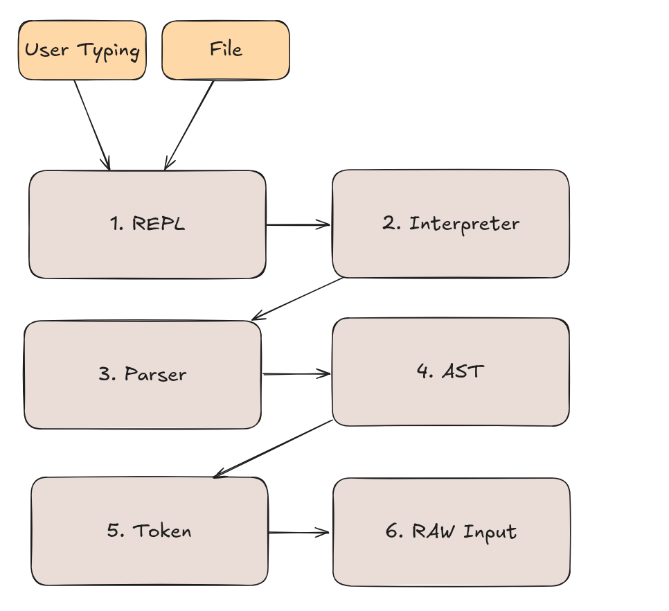

# Tupilang


### Rationale

This is a simple POC on how to create a toy programing language.
Interesting things here:
1. Uses Java 23
2. No libraries, No external dependencies
3. Heavily inspired by Scala 3
4. However, much more simple
5. It's Interpreted but does not use Reflections under the hood
6. The codebase is very minimalist and simple
5. REPL
   * Type code and run on the fly
   * Proper help function
   * CTRL + D to exit or type `exit;`
   * Can run samples in `samples` folder just type `run`
   * `time` function to trace execution time (ms)
6. Tupilang So far supports:
 * Types: Int, String, Void, Bool, array represented by []
 * Keywords: if, return
 * Flow Control: Range For and C-Style For
 * Operators: +, -, *, /, %, ==, !=, <, >, <=, >=, % (modulo)
 * Create functions with def, comments with //
 * String concatenation, Bool concatenation
 * Post Increment with ++ and --
 * Built-in functions: print, len
 * Val is immutable by default if want to mutate keep using val
 * Val automatically detect types.
7. Removed by Design: 
  * No Enums
  * No Abstract classes
  * No Aspects
  * No Switch
  * No While
  * No Recursion
  * No Reflection
  * No Annotations 
  * No Macros
  * No Implicits
  * No Scala Object
  * No Package Object
8. PENDING/Ideas - Might add in the future (TBD): 
  * Collections: Map
  * Pattern matching
  * Traits
  * More built-in functions: map, filter, reduce, etc.
  * Classes (with no setters/getters, no inheritance, no static)
  * Very Simple Generics
  * Unit Test Framework (inside the box)
  * $(j"") string interpolation to call any java code

Tupilang binary: jar size it's only **43KB** <br/>
Created by Diego Pacheco in APRIL/2025.

I wanted a simple version of Scala. But also simple and different. 

### Build 

```bash
./mvnw clean install package
```

### Run REPL

```
./repl.sh
```

### Result

```
❯ ./repl.sh
 _______             _   _
|__   __|           (_) | |
   | | _   _ _ __    _  | |     __ _ _ __   __ _
   | || | | | '_ \  | | | |    / _` | '_ \ / _` |
   | || |_| | |_) | | | | |___| (_| | | | | (_| |
   |_|\__,_| .__/|  |_| |______\__,_|_| |_|\__, |
           | |                              __/ |
           |_|                             |___/

    Tupi Lang by Diego Pacheco
  🌿 Version 1.0-SNAPSHOT - written in Java 23 🌿

:> val x = 10;
:> if (x == 10) {
  print(x);
}... ...
10
:> val xxx = "test";
:> print(xxx);
test
:> def sum(a:Int, b:Int) Int {
  return a + b;
}... ...
:> print(sum(100,200));
300
:>
:> val x = 10;
:> val y = 20;
:> val name = "Diego";
:> def printAll() void {
... print(x);
... print(y);
... print(name);
... }
:> printAll();
10
20
Diego
:>
:> run
Available samples:
  1. array.tupi
  2. bool.tupi
  3. comments.tupi
  4. concat_bool.tupi
  5. function.tupi
  6. ifs.tupi
  7. len.tupi
  8. main.tupi
  9. string_interpolation.tupi
Enter the number of the sample to run (or 0 to cancel): 5

--- Running sample: function.tupi ---
Source code:
def sum(a:Int, b:Int) Int {
  print("Running function sum ");
  val result =  a + b;
  return result;
}
print(sum(52,8));
--- Output ---
"Running function sum "
60
--- End of sample ---

:>


```

### Running .tupi files

```bash
./repl.sh samples/main.tupi
```

samples/main.tupi
```scala
val x = 10;
if (x == 10) {
  print(x);
}

val xxx = "test";
print(xxx);

def sum(a:Int, b:Int) int {
  return a + b;
}
print(sum(x,x));
```

result
```scala
10
test
20
```

### Tests

```bash
./mvnw clean test
```

```
[INFO]
[INFO] Results:
[INFO]
[INFO] Tests run: 131, Failures: 0, Errors: 0, Skipped: 0
[INFO]
[INFO]
```

### How it works?



The execution pipeline starts with the REPL, which reads code either typed by the user or from a 
file, and passes the raw source code to the lexer. The lexer scans the code and produces a 
list of tokens, which are stored in a token stream. This stream is then processed by the parser,
which builds an Abstract Syntax Tree (AST) that represents the structural and semantic 
hierarchy of the program. The AST is handed to the interpreter, which walks through it and
executes the logic, producing runtime effects like printed output, variable assignments, or 
function calls.

## Note on Visitor Pattern / Experiment

The current code is not using Visitor pattern, that's is by design and desire.

##### Centralization on Parser

All ASTs are handled from there. Could be all inside `parser` or `interpreter` classes.
It's keep in there for simplicity and also for debugability and is easier to follow the flow.
This is the current approach.

##### Distribution with Visitor Pattern

The victor pattern helps to add more logic on the AST side of the story.
However, is always the same `acept` method with no much logic. 
The issue IMHO is that the parser flow or options getting hidden across multiple classes
which IMHO gets harder to understand and even to maintain.

### Why not better REPL autocomplete

Java sucks for that. The best option is use JLine. Java does not capture a key stroke on terminal, we need press enter. 
So this kill any code decent terminal ux completion. However, IF I do use JLine that would work but I will break the promise on ZERO LIBS.
Sure the core lang it would still have zero libs and deps and this it would be on the tooling, but not no libs.

### Disclaimers

1. This is a POC language, not a production ready language.
2. Inspired by https://github.com/diegopacheco/writing-interpreter-in-go
3. No Vibe Coding was used at all, but using IntelliJ with Copilot/Sonnet-3.7.
4. It's easy to find bugs, every single thing need to be tested.


